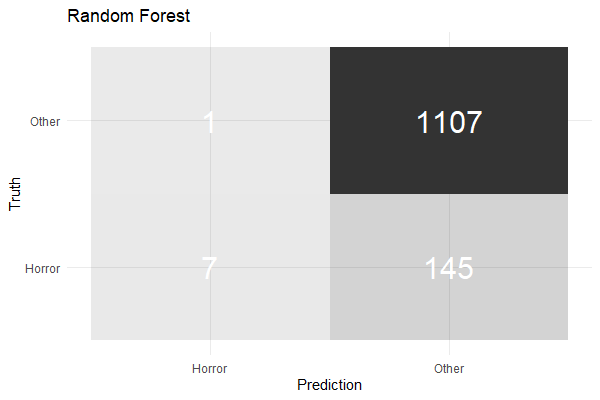

# Imdb Classification Tidymodels

## Introduction
Since I am a big fan of horror movies I wanted to investigate if you can classify movie data with machine learning.
In this project I deal with:
- A web scraping to get data from idbm
- A brief exploratorive data analysis
- Logistic Regression, Random Forest, XGBoost
- Tidymodles

With my web scraper I have managed not only to load data from one page but also to pull data from linked pages. I highly recommend rvest for web scraping. This is an excellent way to get data form the web. My scraper works for the top 250 movies of imdb, but since I need a lot of data for my project and since it is very time consuming to load the data of the 5000 movies, I was looking for a finished data set. For this reason, I started the ML part of this project with a data set from XY.

## Parts of me EDA
After a quick skim() I got a first overview of the dataset. In the following I analysed NA values, skewness, correlations and I plotted each numeric and factor variable with the help of loops.

## Modelling
In the following I made some final adjustments and split the data into test and train data.
```
set.seed(51069)
all_split <- initial_split(all, strata = horror_movie)
all_train <- training(all_split)
all_test <- testing(all_split)
```
Starting with tidymodels:
First, I started with a recipe. I built up this recipe based on the steps of [Hands-On Machine Learning with R](https://bradleyboehmke.github.io/HOML/engineering.html#proper-implementation) (Bradley Boehmke and Brandon Greenwell).
```
  step_knnimpute(all_predictors(), neighbors = 3) %>%
  step_nzv(all_nominal())  %>%
  step_BoxCox(all_numeric(),-all_outcomes()) %>%
  step_center(all_numeric(), -all_outcomes()) %>%
  step_scale(all_numeric(), -all_outcomes()) %>% 
  step_pca(all_numeric(), -all_outcomes())%>%
  step_other(all_nominal(), -all_outcomes(), threshold = 0.01) %>%
  step_dummy(all_nominal(), -all_outcomes())
```
Afterwards, I used the prep, the juice function and started the workflow.
```
all_prep <- prep(all_rec)
juiced <- juice(all_prep)

wf <- workflow() %>%
  add_recipe(all_rec)

test_bake <- all_prep %>%
  bake(all_test)
```
As resampling method, I decided to do a quick k-fold cross validation instead of bootstrapping.
```
vfold <- all_train %>%
  vfold_cv(v = 5, strata = "horror_movie")
```

### Models
The workflow of the Logistic Regression deviated from the workflow of the other models where I also did some parameter tuning.

For the Random Forest and XGBoost I proceeded as following:

1.    Define a parsnip model
2.    Define parameters using dials package
3.    Combine model and recipe using workflows package
4.    Tune the workflow using tune package
5.    Evaluate tuning results
6.    Select best model for prediction
7.    Prediction of target variable using test data
8.    Finally, save the prediction

In addition, I promise not to go too deep into the optimization of each model, as this would go beyond the scope of these projects.

#### Logistic Regression
```
# Define the model 
logistic_glm <- logistic_reg(mode = "classification") %>%
  set_engine("glm")

# Train the model 
logistic_glm <-
  logistic_reg(mode = "classification") %>%
  set_engine("glm") %>%
  fit(horror_movie ~ ., data = juiced)
```
Looking at the accuracy of the model
```
predictions_glm <- logistic_glm %>%
  predict(new_data = test_bake) %>%
  bind_cols(test_bake %>% select(horror_movie))

predictions_glm %>%
  metrics(horror_movie, .pred_class) %>%
  select(-.estimator) %>%
  filter(.metric == "accuracy") 
```
Looking at the confusion matrices
```
predictions_glm %>%
  conf_mat(horror_movie, .pred_class) %>%
  pluck(1) %>%
  as_tibble() %>%
  ggplot(aes(Prediction, Truth, alpha = n)) +
  geom_tile(show.legend = FALSE) +
  geom_text(aes(label = n), colour = "white", alpha = 1, size = 8)
```


#### Random Forest

Random Forest:

1.-3. I decide to tune mtry and min_n. Additionally I did some more specifications.
```
# 1) Define a parsnip model
rf_mod <- rand_forest(
  mtry = tune(),
  trees = 1000,
  min_n = tune()) %>%
  set_mode("classification") %>%
  set_engine("ranger")
 
 # 2) Is not necessary
 
 # 3) Combine model and recipe using workflows package
tune_wf <- workflow() %>%
  add_recipe(all_rec) %>%
  add_model(rf_mod)
```
4.
```
# 4) Tune the workflow using tune package
doParallel::registerDoParallel()

tictoc::tic()
set.seed(51069)
tune_res <- tune_grid(
  tune_wf,
  resamples = vfold,
  grid = 10
)
tictoc::toc()

tune_res
```
5.-6. I used roc_auc to evaluate each model
```
# 5) Evaluate tuning results
show_best(tune_res, "roc_auc", n = 10)

# 6) Select best model for, e.g., prediction
rf_param_best <- select_best(tune_res, metric = "roc_auc")
rf_model_best <- finalize_model(rf_mod, rf_param_best)
rf_model_finalfit <- fit(rf_model_best, horror_movie ~ ., data = juiced)
```
Looking at the tuning parameters


7. Prediction of target variable using test data
```
# 7) Predict on test data
test_prep <- all_prep %>%
  bake(all_test)

final_wf <- workflow() %>%
  add_recipe(all_rec) %>%
  add_model(rf_model_best)

final_res <- final_wf %>%
  last_fit(all_split)
```
Looking at the accuracy of the model and the the confusion matrices
```
final_res %>%
  collect_metrics()

Con_Mat <- final_res$.predictions 
Con_Mat <- as.data.frame(Con_Mat)%>%
  select(.pred_class, horror_movie)
  
Con_Mat %>%
  conf_mat( horror_movie,.pred_class) %>%
  pluck(1) %>%
  as_tibble() %>%
  ggplot(aes(Prediction, Truth, alpha = n)) +
  geom_tile(show.legend = FALSE) +
  geom_text(aes(label = n), colour = "white", alpha = 1, size = 8)
```

